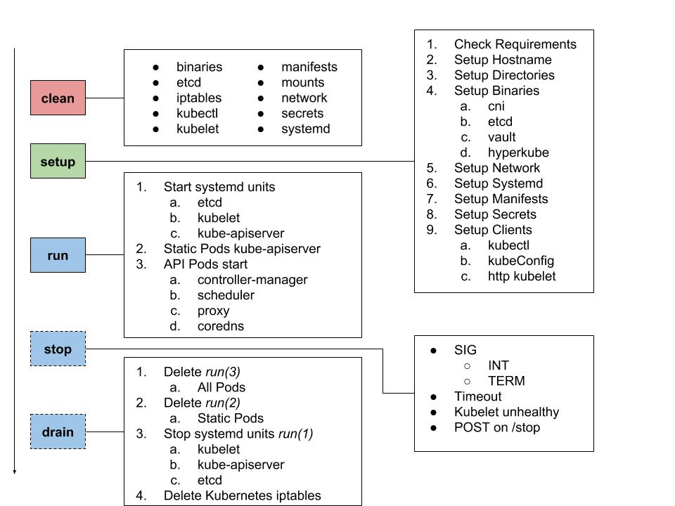

# pupernetes - p8s

[](https://circleci.com/gh/DataDog/pupernetes) [](https://travis-ci.org/DataDog/pupernetes) [](https://goreportcard.com/report/github.com/DataDog/pupernetes)

## Table of Contents
- [Goals](#goals)
- [Requirements](#requirements)
  * [Runtime](#runtime)
    * [Executables](#executables)
    * [Systemd](#systemd)
    * [Resources](#resources)
    * [DNS](#dns)
  * [Development](#development)
    * [Build](#build)
- [Getting started](#getting-started)
  * [Download](#download)
  * [Run](#run)
  * [Stop](#stop)
  * [Systemd as job type](#systemd-as-job-type)
  * [Command line docs](#command-line-docs)
- [Metrics](#metrics)
- [Current limitations](#current-limitations)

## Goals

Run a managed Kubernetes setup.

This project's purpose is to provide a simple Kubernetes setup to validate any software on top of it.

You can use it to validate a software dependency on Kubernetes itself or just to run some classic app workflows with [argo](https://github.com/argoproj/argo).

As pupernetes runs in [travis](./.travis.yml) and [circle-ci](./.circleci/config.yml), it becomes very easy to integrate this tool in any Kubernetes project.

This project has been initially designed to perform the end to end testing of the [datadog-agent](https://github.com/DataDog/datadog-agent).

[](https://asciinema.org/a/5fvTb9iEcvwO3EhqOSmDMIT9O)



**Provides**:
* etcd v3
* kubectl
* kubelet
* kube-apiserver
* kube-scheduler
* kube-controller-manager
* kube-proxy
* coredns

**The default setup is secured with:**
* Valid x509 certificates provided by an embedded vault PKI
    * Able to use the Kubernetes CSR and the service account root-ca
* HTTPS webhook to provide token lookups for the kubelet API
* RBAC

## Requirements

### Runtime

#### Executables

* `tar`
* `unzip`
* `systemctl`
* `systemd-resolve` (or a non-systemd managed `/etc/resolv.conf`)
* `mount`

Additionally any implicit requirements needed by the **kubelet**, like the container runtime and [more](https://github.com/kubernetes/kubernetes/issues/26093).
Currently only reporting `docker`, please see the [current limitations](#current-limitations).

#### Systemd

A recent systemd version is better to gain:
* `systemd-resolve`
* `journalctl --since`
* more convenient dbus API

#### Resources

* 4GB of memory is recommended
* 5GB of free disk space for the binaries and the container images

#### DNS

Ensure your hostname is discoverable:
```bash
dig $(hostname) -short
```

### Development

Pupernetes must be run on linux (or linux VM).

Please see our [ubuntu 18.04](./environments/ubuntu/README.md) notes about it.

To compile `pupernetes`, you need the following binaries:

* `go` **1.10**
* `make`

#### Build

```bash
go get -u github.com/DataDog/pupernetes
cd ${GOPATH}/src/github.com/DataDog/pupernetes
make
```

## Getting started

### Download

You need to download the last version:
```bash
VERSION=0.6.1
curl -LOf https://github.com/DataDog/pupernetes/releases/download/v${VERSION}/pupernetes
chmod +x ./pupernetes
./pupernetes --help
```

### Run

```bash
sudo ./pupernetes daemon run /opt/sandbox/
```

>Note:
>
>`kubectl` can be automatically installed by `pupernetes`.
>
>You need to run the following command to add `kubectl` to the `$PATH`:
>
>```bash
> sudo ./pupernetes daemon run /opt/sandbox/ --kubectl-link /usr/local/bin/kubectl
>```

```bash
$ kubectl get svc,ds,deploy,job,po --all-namespaces

NAMESPACE     NAME         TYPE        CLUSTER-IP      EXTERNAL-IP   PORT(S)         AGE
default       kubernetes   ClusterIP   192.168.254.1   <none>        443/TCP         3m
kube-system   coredns      ClusterIP   192.168.254.2   <none>        53/UDP,53/TCP   3m

NAMESPACE     NAME             DESIRED   CURRENT   READY     UP-TO-DATE   AVAILABLE   NODE SELECTOR   AGE
kube-system   kube-proxy       1         1         1         1            1           <none>          3m
kube-system   kube-scheduler   1         1         1         1            1           <none>          3m

NAMESPACE     NAME      DESIRED   CURRENT   UP-TO-DATE   AVAILABLE   AGE
kube-system   coredns   1         1         1            1           3m

NAMESPACE     NAME                       READY     STATUS    RESTARTS   AGE
kube-system   coredns-747dbcf5df-p2lhq   1/1       Running   0          3m
kube-system   kube-controller-manager    1/1       Running   0          3m
kube-system   kube-proxy-wggdn           1/1       Running   0          3m
kube-system   kube-scheduler-92zrj       1/1       Running   0          3m
```

### Stop

Gracefully stop it with:
* SIGINT
* SIGTERM
* `--timeout`
* `curl -XPOST 127.0.0.1:8989/stop`

### Hyperkube versions

`pupernetes` can start a specific Kubernetes version with the flag `--hyperkube-version=1.9.3`.

These are the current supported versions:
- [x] 1.11
- [x] 1.10
- [x] 1.9
- [x] 1.8
- [x] 1.7
- [x] 1.6
- [x] 1.5
- [ ] 1.4
- [ ] 1.3

### Systemd as job type

It's possible to run pupernetes as a systemd service directly with the command line.
In this case, pupernetes asks to systemd-dbus to be daemonised with the given arguments.
See more info about it in the [run command](./docs/pupernetes_run.md).

This command line is very convenient to run pupernetes in SaaS CI:
* [travis](./examples/travis.yaml)
* [circle-ci](./examples/circleci.yaml)

### Command line docs

The full documentation is available [here](./docs).

## Metrics

Pupernetes exposes prometheus metrics to improve the observability.

You can have a look at which metrics are available [here](./docs/metrics.csv).

## Current limitations

* Container runtime
  * You need docker already up and running
  * You cannot use cri-containerd / crio without changing manually the systemd unit `/run/systemd/system/p8s-kubelet.service`
* Systemd
  * Currently working with systemd only
  * Could be containerized with extensive mounts
    * binaries
    * dbus
* Networking
  * The CNI bridge cannot be used yet
  * Kubernetes cluster IP range is statically set
* Secrets
  * IP SAN
    * Statically configured with the given Kubernetes cluster IP range
* Support for Custom Metrics
  * You can register an API Service for an External Metrics Provider.
  This is only supported for 1.10.x and 1.11.x.
